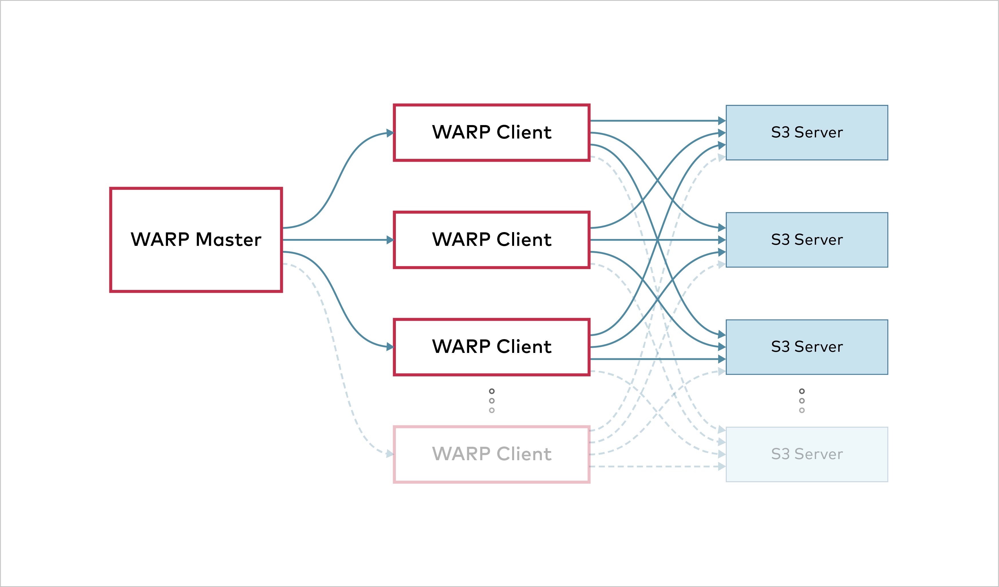

S3 benchmarking tool.

# Download

[Download Binary Releases](https://github.com/minio/warp/releases) for various platforms.

# Configuration

Warp can be configured either using commandline parameters or environment variables. 
The S3 server to use can be specified on the commandline using `--endpoints`, `--access-key`, 
`--secret-key` and optionally `--tls` and `--region` to specify TLS and a custom region.

It is also possible to set the same parameters using the `SERVER_ENDPOINTS`, `ACCESS_KEY`, `SECRET_KEY`, `REGION`

The credentials must be able to read, write and delete objects, buckets are not created by `warp` you need to provide
a pre-existing bucket with a prefix using `--prefix`

Do however note that the `prefix` will be completely cleaned before and after each run, so it should *not* contain any data.

If you are [running TLS](https://docs.min.io/docs/how-to-secure-access-to-minio-server-with-tls.html),  you can enable [server-side-encryption](https://docs.aws.amazon.com/AmazonS3/latest/dev/ServerSideEncryptionCustomerKeys.html)  of objects using `--encrypt`. A random key will be generated and used for objects.

# Usage

`warp command [options]`

Example running a mixed type benchmark against 8 servers named `s3-server-1` to `s3-server-8`  on port 9000 with the provided keys: 

`warp mixed --endpoints=https://s3-server{1...8}:9000 --access-key=minio --secret-key=minio123 --autoterm`

This will run the benchmark for up to 5 minutes and print the results.

# Benchmarks

All benchmarks operate concurrently.  By default the processor determines the number of operations that will be running concurrently. 
This can however also be tweaked using the `--concurrent` parameter.

Tweaking concurrency can have an impact on performance, especially if latency to the server is tested. 
Most benchmarks will also use different prefixes for each "thread" running.

By default all benchmarks save all request details to a file named `warp-operation-yyyy-mm-dd[hhmmss]-xxxx.csv.zst`.  A custom file name can be specified using the `--benchdata` parameter.  The raw data is [zstandard](https://facebook.github.io/zstd/) compressed CSV data.

## Multiple Hosts

Multiple S3 hosts can be specified as comma-separated values, for instance  `--endpoints=http://10.0.0.1:9000,http://10.0.0.2:9000` will switch between the specified servers.

Alternatively numerical ranges can be specified using `--endpoints=http://10.0.0.{1...10}:9000` which will add  `10.0.0.1` through `10.0.0.10`. This syntax can be used for any part of the host name and port.

By default a endpoint is chosen from the endpoints that have the least number of requests running  and with the longest time since the last request finished. This will ensure that in cases where endpoints operate at different speeds that the fastest servers will get the most requests.  It is possible to choose a simple round-robin algorithm by using the `--endpoint-select=roundrobin` parameter.  If there is only one host this parameter has no effect.

When benchmarks are done per host averages will be printed out.  For further details, the `--analyze.hostdetails` parameter can also be used.

# Distributed Benchmarking



It is possible to coordinate several warp instances automatically. This can be useful for testing performance of a cluster from several clients at once.

For reliable benchmarks, clients should have synchronized clocks. Warp checks whether clocks are within one second of the server, but ideally, clocks should be synchronized with [NTP](http://www.ntp.org/) or a similar service.

## Agent Setup

WARNING: Never run warp agents on a publicly exposed port. Agents have the potential to DDOS any service.

Agents are started with

```
warp agent [listenaddress:port]
```

`warp agent` Only accepts an optional host/ip to listen on, but otherwise no specific parameters. By default warp will listen on `127.0.0.1:7761`.

Only one server can be connected at the time. However, when a benchmark is done, the agent can immediately run another one with different parameters.

There will be a version check to ensure that agents are compatible with the server, but it is always recommended to keep warp versions the same.

## Submit a Benchmark to Agents

Any benchmark can be submitted to agents, when warp is invoked as a submitter benchmarking will be done on the agents. Each agent executes the benchmark.

The submitter will coordinate the benchmark runs and make sure they are run correctly.

When the benchmark has finished, the combined benchmark info will be collected, merged and saved/displayed. Each client will also save its own data locally.

Submitting benchmark remotely to agents is done by adding `--agents=http://agent-{1...10}`. If no host port is specified the default is added.

Example:

```
warp get --duration=3m --agents=http://client-{1...10} --endpoints=https://server-{1...16} --access-key=minio --secret-key=minio123
```

Note that parameters apply to *each* client. So if `--concurrent=8` is specified each agent will run with 8 concurrent operations.  If a warp is unable to connect to an agent the entire benchmark is aborted.

If the warp looses connection to an agent during a benchmark run an error will  be displayed and the `warp` will attempt to reconnect.  If the `warp` is unable to reconnect, the benchmark will continue with the remaining agents.

## Benchmark Data

By default warp uploads random data.

### Object Size

Most benchmarks use the `--obj.size` parameter to decide the size of objects to upload.

Different benchmark types will have different default values.

#### Random File Sizes

It is possible to randomize object sizes by specifying  `--obj.randsize`  and files will have a "random" size up to `--obj.size`. However, there are some things to consider "under the hood".

We use log2 to distribute objects sizes. This means that objects will be distributed in equal number for each doubling of the size.
This means that `obj.size/64` -> `obj.size/32` will have the same number of objects as `obj.size/2` -> `obj.size`.

Example of objects (horizontally) and their sizes, 100MB max:


To see segmented request statistics, use the `-requests` parameter.

```
λ warp analyze warp-get-2020-01-07[024225]-QWK3.csv.zst -requests -analyze.op=GET
-------------------
Operation: GET. Concurrency: 12. Hosts: 1.

Requests considered: 1970. Multiple sizes, average 18982515 bytes:

Request size 100B -> 100KiB. Requests - 274:
 * Throughput: Average: 9.5MiB/s, 50%: 8.8MiB/s, 90%: 1494.8KB/s, 99%: 167.3KB/s, Fastest: 95.8MiB/s, Slowest: 154.8KB/s
 * First Byte: Average: 4.131413ms, Median: 3.9898ms, Best: 994.4µs, Worst: 80.7834ms

Request size 100KiB -> 10MiB. Requests - 971:
 * Throughput: Average: 62.8MiB/s, 50%: 49.7MiB/s, 90%: 39.5MiB/s, 99%: 33.3MiB/s, Fastest: 1171.5MiB/s, Slowest: 6.6MiB/s
 * First Byte: Average: 5.276378ms, Median: 4.9864ms, Best: 993.7µs, Worst: 148.6016ms

Request size 10MiB -> 100MiB. Requests - 835:
 * Throughput: Average: 112.3MiB/s, 50%: 98.3MiB/s, 90%: 59.4MiB/s, 99%: 47.5MiB/s, Fastest: 1326.3MiB/s, Slowest: 45.8MiB/s
 * First Byte: Average: 4.186514ms, Median: 4.9863ms, Best: 990.2µs, Worst: 16.9915ms

Throughput:
* Average: 1252.19 MiB/s, 68.58 obj/s (28.885s, starting 02:42:27 PST)

Aggregated Throughput, split into 28 x 1s time segments:
 * Fastest: 1611.21 MiB/s, 64.32 obj/s (1s, starting 02:42:40 PST)
 * 50% Median: 1240.15 MiB/s, 74.85 obj/s (1s, starting 02:42:41 PST)
 * Slowest: 1061.56 MiB/s, 47.76 obj/s (1s, starting 02:42:44 PST)
```

## Automatic Termination
Adding `--autoterm` parameter will enable automatic termination when results are considered stable. 
To detect a stable setup, warp continuously downsample the current data to 
25 data points stretched over the current timeframe.

For a benchmark to be considered "stable", the last 7 of 25 data points must be within a specified percentage. 
Looking at the throughput over time, it could look like this:


The red frame shows the window used to evaluate stability. 
The height of the box is determined by the threshold percentage of the current speed. 
This percentage is user configurable through `--autoterm.pct`, default 7.5%. 
The metric used for this is either MiB/s or obj/s depending on the benchmark type.

To make sure there is a good sample data, a minimum duration of the 7 of 25 samples is set. 
This is configurable `--autoterm.dur`. This specifies the minimum time length the benchmark must have been stable.

If the benchmark doesn't autoterminate it will continue until the duration is reached. 
This cannot be used when benchmarks are running remotely.

A permanent 'drift' in throughput will prevent automatic termination, 
if the drift is more than the specified percentage.
This is by design since this should be recorded.

When using automatic termination be aware that you should not compare average speeds, 
since the length of the benchmark runs will likely be different. 
Instead 50% medians are a much better metrics.

## Mixed

Mixed mode benchmark will test several operation types at once. 
The benchmark will upload `--objects` objects of size `--obj.size` and use these objects as a pool for the benchmark. 
As new objects are uploaded/deleted they are added/removed from the pool.

The distribution of operations can be adjusted with the `--get-distrib`, `--stat-distrib`,
 `--put-distrib` and `--delete-distrib` parameters.  
 The final distribution will be determined by the fraction of each value of the total. 
 Note that `put-distrib` must be bigger or equal to `--delete-distrib` to not eventually run out of objects.  
 To disable a type, set its distribution to 0.

Example:
```
λ warp mixed --duration=1m
[...]
Mixed operations.

Operation: GET
 * 632.28 MiB/s, 354.78 obj/s (59.993s, starting 07:44:05 PST) (45.0% of operations)

Operation: STAT
 * 236.38 obj/s (59.966s, starting 07:44:05 PST) (30.0% of operations)

Operation: PUT
 * 206.11 MiB/s, 118.23 obj/s (59.994s, starting 07:44:05 PST) (15.0% of operations)

Operation: DELETE
 * 78.91 obj/s (59.927s, starting 07:44:05 PST) (10.0% of operations)
```

It is possible to get request statistics by adding the `--requests` parameter:
```
λ warp mixed --duration=1m --requests
Mixed operations.

Operation: GET
 * 725.42 MiB/s, 72.54 obj/s (59.961s, starting 07:07:34 PST) (45.0% of operations)

Requests considered: 4304:
 * Avg: 131ms 50%: 124ms 90%: 300ms 99%: 495ms Fastest: 7ms Slowest: 700ms
 * First Byte: Average: 6ms, Median: 3ms, Best: 0s, Worst: 185ms

[...]
```

If multiple hosts were used statistics for each host will also be displayed.

A similar benchmark is called `versioned` which operates on versioned objects.

## GET

Benchmarking get operations will upload `--objects` objects of size `--obj.size` 
and attempt to download as many it can within `--duration`.

Objects will be uploaded with `--concurrent` different prefixes, 
except if `--noprefix` is specified. Downloads are chosen randomly between all uploaded data.

When downloading, the benchmark will attempt to run `--concurrent` concurrent downloads.

The analysis will include the upload stats as `PUT` operations and the `GET` operations.

```
Operation: GET
* Average: 2344.50 MiB/s, 234.45 obj/s, 234.44 ops ended/s (59.119s)

Aggregated, split into 59 x 1s time segments:
* Fastest: 2693.83 MiB/s, 269.38 obj/s, 269.00 ops ended/s (1s)
* 50% Median: 2419.56 MiB/s, 241.96 obj/s, 240.00 ops ended/s (1s)
* Slowest: 1137.36 MiB/s, 113.74 obj/s, 112.00 ops ended/s (1s)
```

The `GET` operations will contain the time until the first byte was received.
This can be accessed using the `-requests` parameter.

## PUT

Benchmarking put operations will upload objects of size `--obj.size` until `--duration` time has elapsed.

Objects will be uploaded with `--concurrent` different prefixes, except if `--noprefix` is specified.

```
Operation: PUT
* Average: 971.75 MiB/s, 97.18 obj/s, 97.16 ops ended/s (59.417s)

Aggregated, split into 59 x 1s time segments:
* Fastest: 1591.40 MiB/s, 159.14 obj/s, 161.00 ops ended/s (1s)
* 50% Median: 919.79 MiB/s, 91.98 obj/s, 95.00 ops ended/s (1s)
* Slowest: 347.95 MiB/s, 34.80 obj/s, 32.00 ops ended/s (1s)
```

It is possible by forcing md5 checksums on data by using the `--md5` option. 

## DELETE

Benchmarking delete operations will upload `--objects` objects of size `--obj.size` and attempt to
delete as many it can within `--duration`.

The delete operations are done in `--batch` objects per request in `--concurrent` concurrently running requests.

If there are no more objects left the benchmark will end.

The analysis will include the upload stats as `PUT` operations and the `DELETE` operations.

```
Operation: DELETE 100 objects per operation
* Average: 2520.27 obj/s, 25.03 ops ended/s (38.554s)

Aggregated, split into 38 x 1s time segments:
* Fastest: 2955.85 obj/s, 36.00 ops ended/s (1s)
* 50% Median: 2538.10 obj/s, 25.00 ops ended/s (1s)
* Slowest: 1919.86 obj/s, 23.00 ops ended/s (1s)
```

## LIST

Benchmarking list operations will upload `--objects` objects of size `--obj.size` with `--concurrent` prefixes. 
The list operations are done per prefix.

The analysis will include the upload stats as `PUT` operations and the `LIST` operations separately. 
The time from request start to first object is recorded as well and can be accessed using the `--requests` parameter.

```
Operation: LIST 833 objects per operation
* Average: 30991.05 obj/s, 37.10 ops ended/s (59.387s)

Aggregated, split into 59 x 1s time segments:
* Fastest: 31831.96 obj/s, 39.00 ops ended/s (1s)
* 50% Median: 31199.61 obj/s, 38.00 ops ended/s (1s)
* Slowest: 27917.33 obj/s, 35.00 ops ended/s (1s)
```

## STAT

Benchmarking [stat object](https://docs.min.io/docs/golang-client-api-reference#StatObject) operations 
will upload `--objects` objects of size `--obj.size` with `--concurrent` prefixes.

The main benchmark will do individual requests to get object information for the uploaded objects.

Since the object size is of little importance, only objects per second is reported.

Example:
```
$ warp stat --autoterm
[...]
-------------------
Operation: STAT. Concurrency: 12. Hosts: 1.
* Average: 9536.72 obj/s (36.592s, starting 04:46:38 PST)

Aggregated Throughput, split into 36 x 1s time segments:
 * Fastest: 10259.67 obj/s (1s, starting 04:46:38 PST)
 * 50% Median: 9585.33 obj/s (1s, starting 04:47:05 PST)
 * Slowest: 8897.26 obj/s (1s, starting 04:47:06 PST)
```

