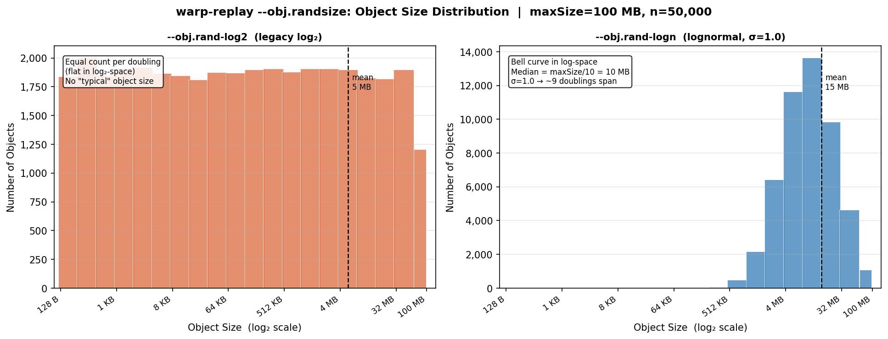

# warp-replay

**warp-replay** is a fork of [MinIO warp](https://github.com/minio/warp), the S3 benchmarking
tool. It adds two significant capabilities on top of upstream warp:

1. **Workload replay** — replay any prior warp trace (`.csv.zst`) against a new target, or replay
   traces produced by other tools.
2. **Streaming per-transaction log** (`--full`) — write a live, zstandard-compressed per-operation
   CSV log during every benchmark run, enabling precise post-hoc analysis. Unlike the upstream
   in-memory `--full` PR (where RAM usage grows with every operation recorded), **warp-replay
   streams directly to disk and uses only a few MB of RAM regardless of run duration or
   concurrency level**.

---

## Documentation

| Document | Description |
|----------|-------------|
| [docs/README-Upstream.md](docs/README-Upstream.md) | Full upstream warp documentation (benchmarks, configuration, analysis, distributed mode, InfluxDB, …) |
| [docs/README_ICEBERG.md](docs/README_ICEBERG.md) | Iceberg REST catalog benchmarks (`iceberg catalog-read`, `catalog-commits`, `catalog-mixed`, `sustained`) |
| [docs/Warp-streaming-log-Design.md](docs/Warp-streaming-log-Design.md) | Design notes for the streaming log writer |

---

## Building

```bash
# Recommended: injects correct version/commit info
make build

# Quick dev build (version shows as "dev")
go build -o warp-replay .
```

Requires Go 1.21+.

---

## New Features in warp-replay

### Workload Replay (`replay`)

```bash
warp-replay replay --file=warp-put-2026-04-07[162451]-abcd.csv.zst \
    --bucket=my-bucket \
    --host=s3target:9000 \
    --access-key=mykey \
    --secret-key=mysecret
```

Reads every operation recorded in a `.csv.zst` trace file and replays it against
the specified S3 target. Object host/path mappings can be remapped via an optional
YAML config (`--config`).

**Use cases:**
- Reproduce a production workload exactly against a new cluster or storage tier.
- Replay workloads generated by other tools that produce warp-compatible trace files.
- The [s3dlio](https://github.com/russfellows/s3dlio) library can emit warp-format
  traces, making any s3dlio-based workload replayable via warp-replay.

Replay also supports `--log-warp-ops` to record the replayed operations into a new
`.csv.zst` trace for further analysis.

### Full Per-Transaction Log (`--full`)

Adding `--full` to any benchmark command writes **both** output files:

| File | Contents |
|------|----------|
| `<benchdata>.csv.zst` | Every individual request — one row per operation, zstandard-compressed CSV |
| `<benchdata>.json.zst` | Aggregated summary (same as default) |

```bash
warp-replay put --host=... --full
warp-replay run --full benchmark.yaml
```

> **Streaming, not in-memory:** A `--full` implementation has been submitted as a PR to
> upstream warp, but that implementation accumulates every operation record in RAM — memory
> usage grows linearly with the number of operations and can become very large on long or
> high-concurrency runs. warp-replay's implementation is fundamentally different: operations
> are streamed through a background goroutine directly to a zstd-compressed file on disk.
> **RAM overhead is constant at a few MB, regardless of run duration or operation count.**
> There is no practical limit on run length when using `--full` with warp-replay.

---

## Realistic Object Size Distribution (`--obj.randsize`)

The upstream `--obj.randsize` flag uses a **log₂ (log-base-2) distribution**: it samples
uniformly in log₂-space, which means every doubling of size gets equal probability weight.
The resulting curve has no "typical" object size — objects are as likely to fall in the
4–8 MB range as in the 50–100 MB range, which does not resemble real-world workloads.

warp-replay replaces this with a **lognormal distribution** — the standard statistical model
for real-world file system and object store size distributions. The distribution is
parameterised so its **median sits at `maxSize / 10`** and with the default σ=1.0 it spans
approximately 8–9 doublings, closely matching the _spread_ of the original while producing a
realistic bell-curve shape in log-space (many mid-sized objects, a natural tail of large ones).
The mean is approximately **16.5% of maxSize** — nearly identical to the original's 17.9%.

Both distributions are shown below in the same sorted-sample format used in the upstream README
(X = objects sorted ascending by size, Y = size in bytes):



*50,000 samples, maxSize=100 MB. Left: legacy log₂ (upstream) — perfectly flat, equal count
per doubling, no "typical" size. Right: warp-replay lognormal (σ=1.0, median=10 MB) —
clear bell curve, similar span.*

### Tuning the spread

Three flags control random-size behaviour:

| Flag | Distribution | Backward compat? |
|------|-------------|-----------------|
| `--obj.randsize` | Legacy log₂ (original upstream behaviour) | **Yes** — unchanged |
| `--obj.rand-log2` | Legacy log₂ (explicit alias) | Yes |
| `--obj.rand-logn` | Lognormal (new, realistic) | — |

`--obj.randsize.sigma` applies only to `--obj.rand-logn` and controls the log-space standard
deviation (default **1.0**, ~9 doublings of spread):

| `--obj.randsize.sigma` | Spread | Typical use |
|------------------------|--------|-------------|
| `0.75` | Narrow — ~6 doublings | Focused, same-tier stress test |
| `1.0` | Default — ~9 doublings | General purpose |
| `1.5` | Wide — ~13 doublings | Archival / mixed-tier workloads |

```bash
# Backward-compatible: identical to original warp behaviour
warp-replay put --obj.size=100MiB --obj.randsize

# Explicit log₂ alias
warp-replay put --obj.size=100MiB --obj.rand-log2

# New lognormal (bell curve, realistic workloads)
warp-replay put --obj.size=100MiB --obj.rand-logn

# Lognormal with tighter distribution (σ=0.75)
warp-replay put --obj.size=100MiB --obj.rand-logn --obj.randsize.sigma=0.75
```

YAML config equivalents: `obj.rand-size` (log₂), `obj.rand-log-2` (log₂), `obj.rand-log-n` (lognormal), `obj.rand-size-sigma`.

---

## Analyzing Results

The built-in `warp analyze` command provides basic analysis. For **much faster,
richer, and more flexible analysis** of `.csv.zst` trace files, use
[**polarWarp**](https://github.com/russfellows/polarWarp):

> **[polarWarp](https://github.com/russfellows/polarWarp)** is a high-performance
> analysis tool built on [Polars](https://pola.rs) that processes warp trace files
> orders of magnitude faster than the built-in analyzer, with richer output,
> filtering, and charting capabilities.

```bash
# Built-in analyzer (slow on large traces)
warp-replay analyze --full warp-put-2026-04-07[162451]-abcd.csv.zst

# polarWarp — recommended for all serious analysis
pip install polarwarp   # or see https://github.com/russfellows/polarWarp
polarwarp warp-put-2026-04-07[162451]-abcd.csv.zst
```

**polarWarp is particularly valuable for `.csv.zst` trace files** produced with
`--full`, where the built-in analyzer must deserialize every row sequentially.
polarWarp leverages Polars' parallel columnar engine and processes the same files
in a fraction of the time — see [github.com/russfellows/polarWarp](https://github.com/russfellows/polarWarp)
for benchmarks and usage.

### Comparing runs

```bash
warp-replay cmp before.csv.zst after.csv.zst
```

Or use [polarWarp](https://github.com/russfellows/polarWarp) for side-by-side
comparison with statistical significance testing and charts.

---

## All Standard Warp Benchmarks

warp-replay supports every benchmark from upstream warp unchanged:
`get`, `put`, `delete`, `list`, `stat`, `mixed`, `versioned`, `multipart`,
`multipart-put`, `append`, `zip`, `snowball`, `fanout`, `retention`, and
the full Iceberg REST catalog suite.

See [docs/README-Upstream.md](docs/README-Upstream.md) for complete documentation
of all benchmarks, configuration options, distributed mode, YAML config files,
InfluxDB integration, and server profiling. For Iceberg-specific details see
[docs/README_ICEBERG.md](docs/README_ICEBERG.md).

---

## Quick Start

```bash
# Clone and build
git clone https://github.com/russfellows/warp-replay.git
cd warp-replay
make build

# Run a PUT benchmark with full per-transaction logging
./warp-replay put --host=minio:9000 --access-key=minio --secret-key=minio123 \
    --duration=60s --full

# Analyze with polarWarp (recommended)
# https://github.com/russfellows/polarWarp
polarwarp warp-put-*.csv.zst

# Or with the built-in analyzer
./warp-replay analyze --full warp-put-*.csv.zst

# Replay the recorded workload against a different target
./warp-replay replay --file=warp-put-*.csv.zst \
    --bucket=test-bucket --host=new-target:9000 \
    --access-key=minio --secret-key=minio123
```

---

## License

AGPL-3.0 — same as upstream warp. Replay additions © 2025 Signal65 / Futurum Group LLC.
